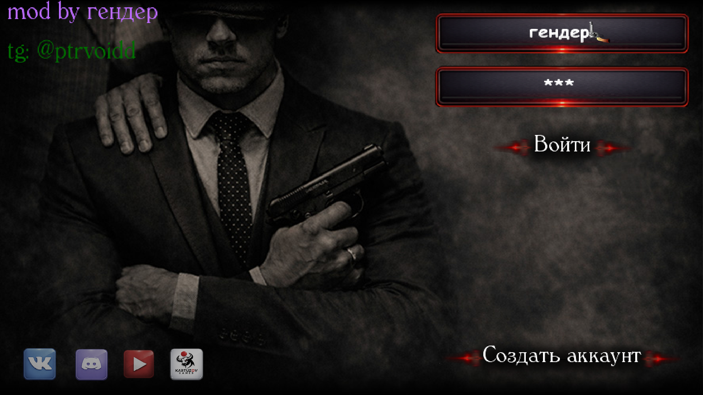
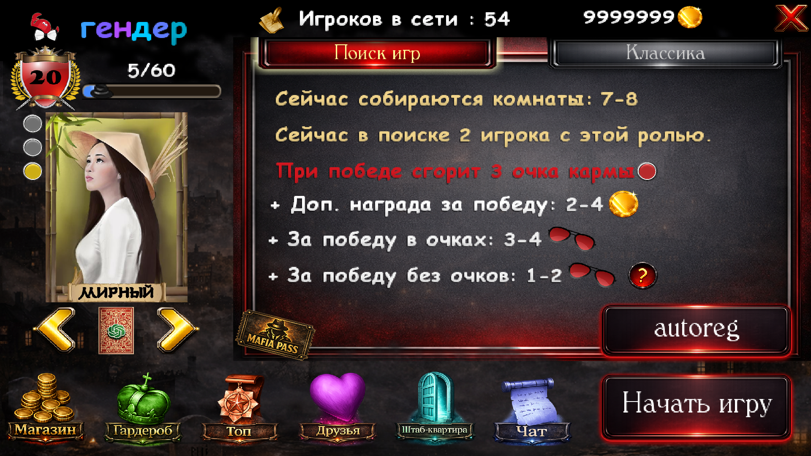
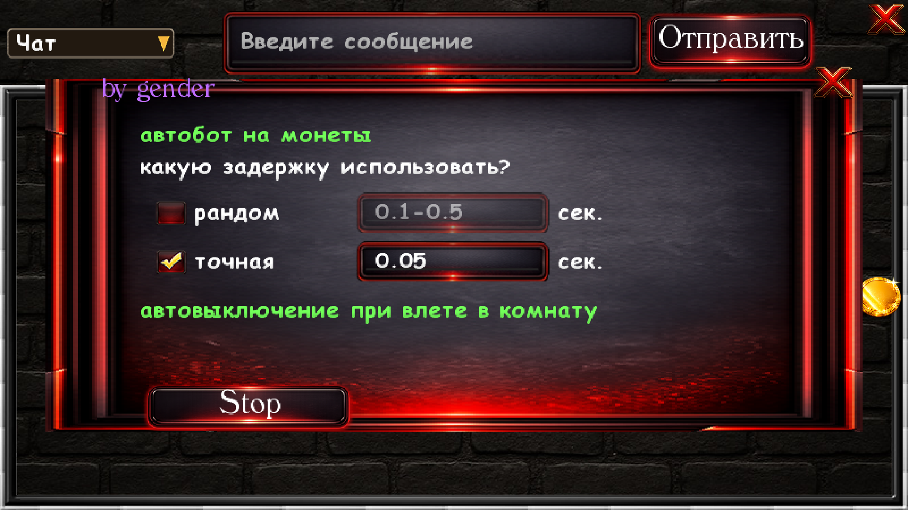
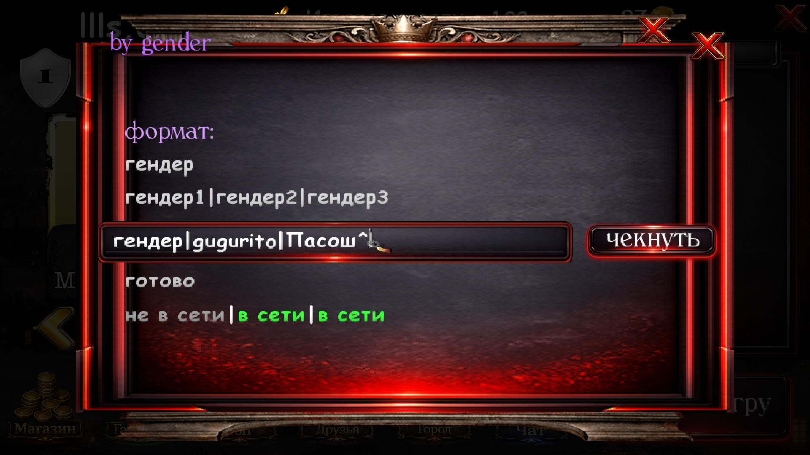
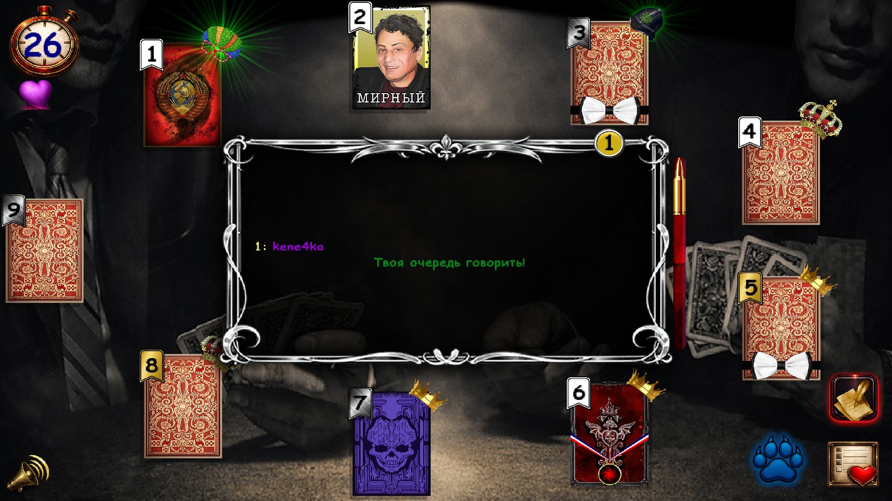
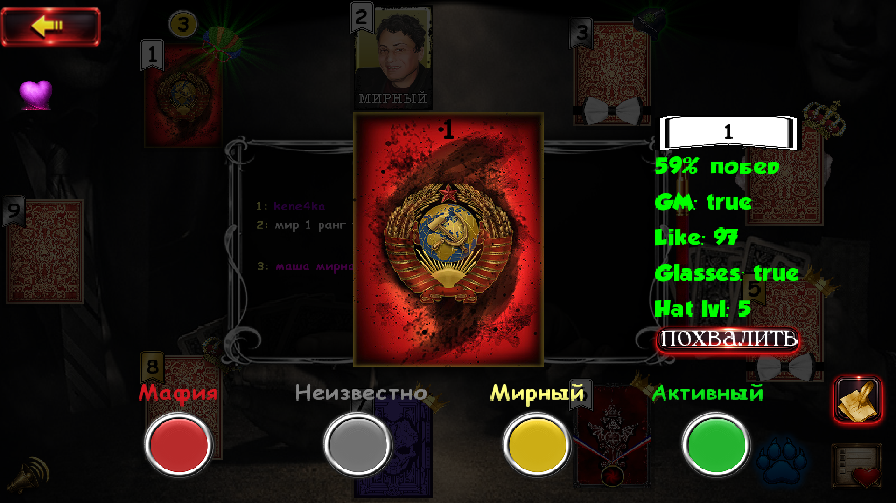
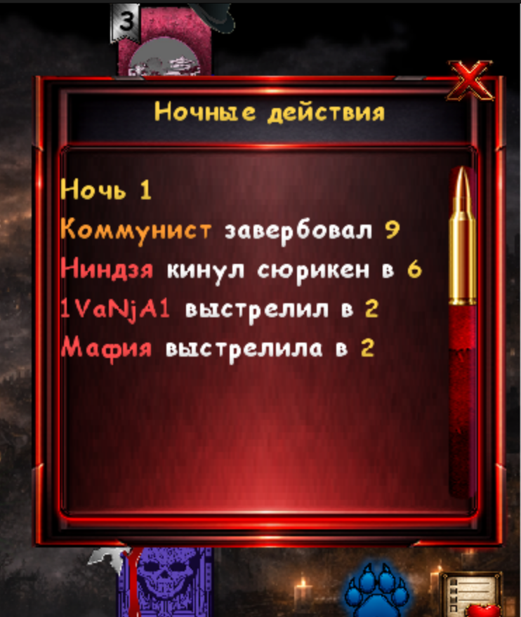
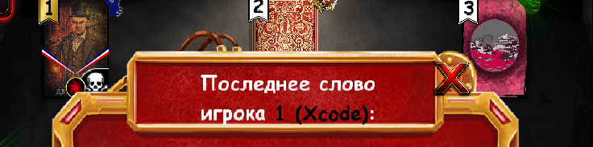
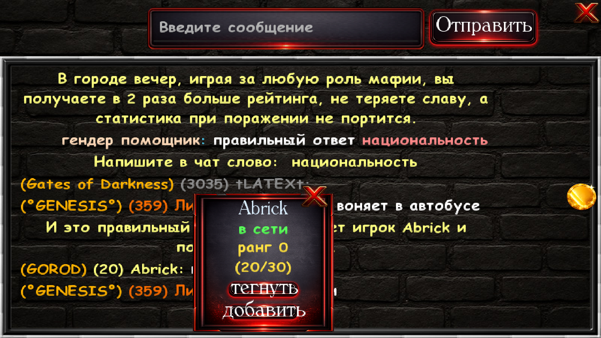
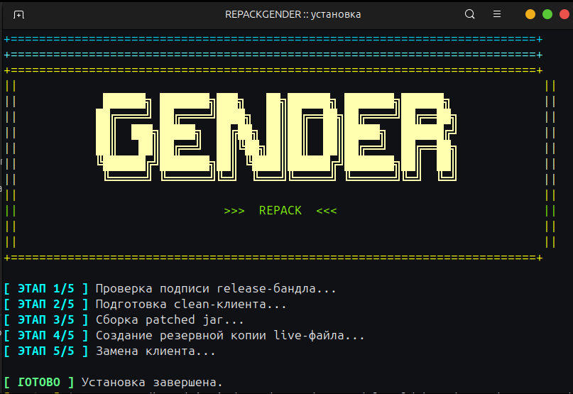

скачать архив можно сразу по этой ссылке: [Download ZIP](https://github.com/0ddamage/gaid-na-mafia-online/archive/refs/heads/main.zip)

# гайд на мафия онлине
сам факт использования мода не виден разработчикам.<br>
на скринах очевидно показан не весь функционал<br>
также в моде добавлена поддержка фоновой работы клиента: при свернутом окне больше не кикает при влете в комнату/не ломается таймер и т.д.

tg: @ptrvoidd

## что нужно

- установленная игра `Mafia Online` в Steam

## быстрый запуск

1. скачай архив по ссылке [Download ZIP](https://github.com/0ddamage/gaid-na-mafia-online/archive/refs/heads/main.zip)
2. ОБЯЗАТЕЛЬНО распакуй архив:
   - открой папку `загрузки` (`downloads`) и найди файл `gaid-na-mafia-online-main.zip`
   - windows: нажми правой кнопкой по zip -> `извлечь все...` (`extract all...`) -> `извлечь`
   - macos: дважды нажми на zip, папка распакуется рядом автоматически
   - linux: нажми правой кнопкой по zip -> `extract` / `извлечь`
3. уже из извлеченных файлов открой папку под свою ос: `windows`, `macos` или `linux`

### Windows

1. открой папку `windows`
2. запусти `install.bat`

### macOS

1. открой папку `macos`
2. запусти `install.command`
3. скрипт сам сначала проверит файлы.
4. если игра не нашлась автоматически, просто укажи папку с игрой или сам файл игры.
5. если macos блокирует запуск `.command`, открой `terminal` и запусти:
   ```bash
   cd ~/Downloads/gaid-na-mafia-online-main
   xattr -dr com.apple.quarantine .
   chmod +x macos/*.command
   ./macos/install.command
   ```

### Linux

1. открой папку `linux`
2. запусти `install.sh`

## гайд как не вбаниться
чтобы не пробанить глупо свою основу, важно понимать, какие данные собирает о вас разработчик.
сейчас вы будете играть через стим, с андроидом/айос отдельная история.
здесь не собираются данные об устройстве, только о вашем стим аккаунте.
пакет, который вы передаете разработчику при каждом логине в игру, выглядит так:

```bash
{
  "event": "Login",
  "payload": {
    "i": "d",
    "color": false,
    "version": 491.0,
    "me": false,
    "steamId": "(много цифр)",
    "sand": {
      "v": 2742830513750,
      "b": 537123195212911
    },
    "isUsePassword": true,
    "login": "гендер",
    "o": "A9afPreTj8aCDO4hBg5vaeraYwwh5iispnfovExWIPo=",
    "password": "1234"
  }
}
```

где:
1. `i` - платформенный клиентский идентификатор. в apple/android ветке `i` это длинный device profile, в steam ветке он упрощен до `"d"`. по сути никакой инфы не передает.
2. `color` - никакого смысла не несет, тоже один из идентификаторов нерабочих.
3. `version` - актуальная версия от разработчика для steam.
4. `me` - также не несет никакого смысла. для android устройств он был предназначен для проверки на эмулятор, для steam бесполезен.
5. `steamId` - это длинный auth ticket, который передает разработчику ваш steamid аккаунта и время логина в игру. официальной расшифровки формата нет, я делал просто эвристический разбор бинарника и эти данные смог вычленить оттуда. этого достаточно, чтобы понимать, что ваш стим аккаунт могут забанить в один клик, и у вас будет появляться плашка `Не удалось проверить аккаунт Steam` при логине в игру.
6. `sand` - просто таймстампы. текущее время в миллисекундах, свежесть запроса, анти-replay.
7. `o` - подпись клиента base64, для проверки целостности клиента(антимод). мой мод ее не изменяет, остается официальной.

то есть, прежде чем идти хуйней страдать с модом на левом акке, держите в уме, что, если разработчик проверит ваш логин, он там найдет стим айди аккаунта, а по стим айди аккаунта найдет абсолютно все аккаунты, на которые были входы с этого стим айди аккаунта, и просто пробанит их все.

поэтому настоятельно рекомендую: если вы все-таки решитесь хуйней страдать с мода, зайдите с нового стим аккаунта и не связывайте его с вашей основой.

## что делают скрипты

- ищут установленную игру через steam-библиотеки
- на windows стараются использовать java рядом с уже установленной игрой, если она там есть
- если java еще не установлена, сами пробуют скачать и подготовить ее
- сначала проверяют, что файлы не были подменены
- умеют работать даже если steam закрыт
- если чистый клиент не найден, сами пытаются запустить проверку файлов через steam и дождаться нужной версии
- перед заменой создают резервную копию текущего клиента

## восстановление чистого клиента

используй `restore`-скрипт из папки своей ос:

- windows: `windows/restore.bat`
- macos: `macos/restore.command`
- linux: `linux/restore.sh`

## если установка не прошла

1. проверь целостность файлов игры в steam
2. запусти установку еще раз
3. если автопоиск не сработал, укажи папку с игрой или сам файл игры
4. если ошибка повторяется, напиши любому ИИ, приложи ссылку на гитхаб и напиши, на каком этапе все встало. если ИИ не смог помочь, можешь написать в личные сообщения в группе тг, я подскажу
